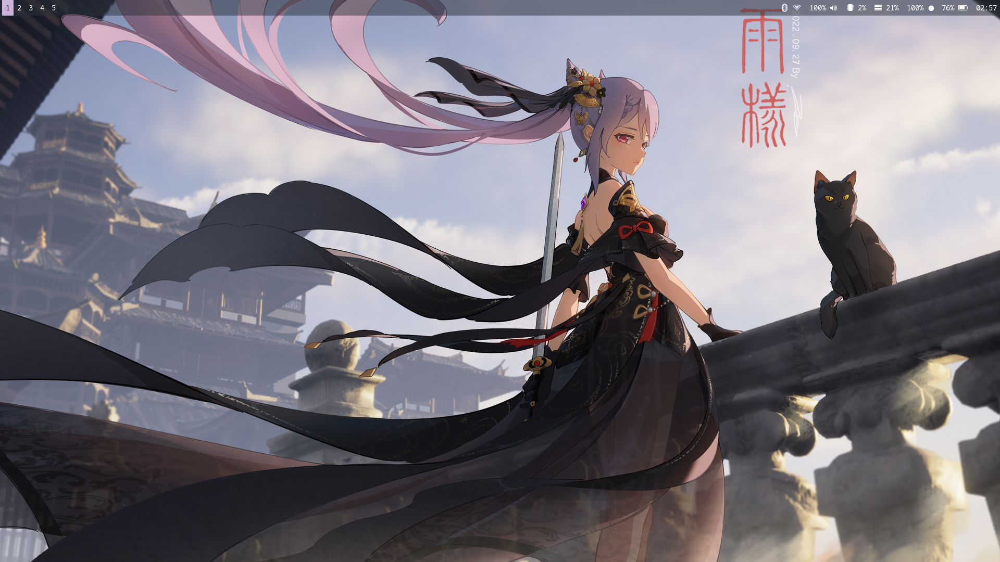

# Sage Rice (work in progress)*
## **warning this my personal rice config and is only ment for my use, it can break or cause other issues if used.**
<p align="center"> </p>

### Requirements
- Sway (WM)
- Wofi (Application Launcher)
- Waybar (bar)
- Swaylock (lockscreen)
- sddm (Display Manager)
- ttf-font-awesome-4 ttf-font-awesome-5 (fonts)
- qt5-graphicaleffects qt5-svg qt5-quickcontrols2 (sddm dependencies)

#### Endeavouros Sway
```bash
yay -Syy ttf-font-awesome-4 ttf-font-awesome-5 qt5-graphicaleffects qt5-svg qt5-quickcontrols2
```
#### Additional Packages for me
```bash
yay -Syy gvfs gvfs-mtp gvfs-nfs gvfs-smb tumbler
```

# Installation

## Automatic installation

#### oneline installation command

```bash
git clone https://github.com/codevshivam/sage-ricing.git
cd sage-ricing
chmod +x install.sh
sudo ./install.sh
```
#### Alternative Method

- git clone this repo

```bash
git clone https://github.com/codevshivam/sage-ricing.git
```

- open terminal in the sage-ricing folder
- give executable permission to the script
```bash
chmod +x install.sh
```

- run the script

```bash
sudo ./install.sh
```

## Manual Method

- Clone or Download the git repo
- move the files in the **.config** folder in your home directory **Except** 
  - Dracula.theme
  - sddm-frappe
  - default.conf
  - install.sh
  - preview.png
- move the **xfce4** folder to **./Local/share/**
- Copy and Paste the **sddm-frappe** folder to **/usr/share/sddm/themes/**
- Edit the file in **/etc/sddm.conf.d/** and change the theme in **default.conf** from whatever was before to **sddm-frappe**
- (optional) Delete all files other than default.conf
- If you don't have this file make one and make sure it has these two lines within the config.

```bash 
  [Theme]
  Current=sddm-frappe
```

# Post Installation
- Apply xfce-terminal theme
- Type **xfce4-terminal --show-menubar** in the terminal
- go to **Edit > Preferences > Colors**
- in the Presets option (at bottom left)
- Select the theme (here Dracula)

#### reboot once
#### delete the sage-ricing folder
### Credits
- ssdm theme: catppuccin (https://github.com/catppuccin)
